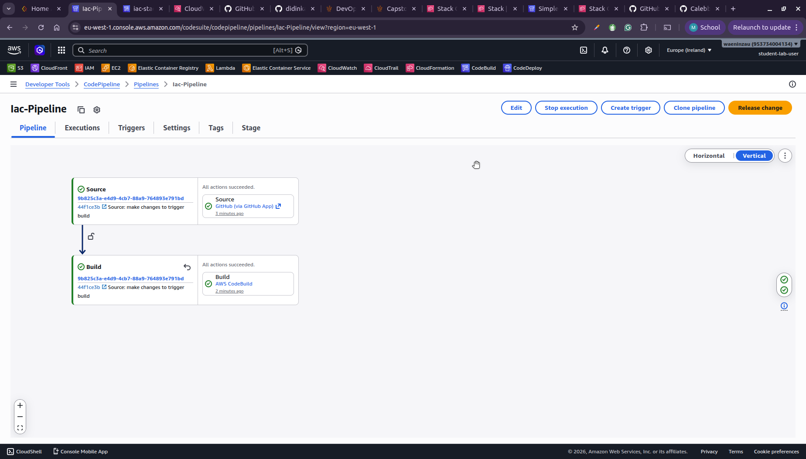
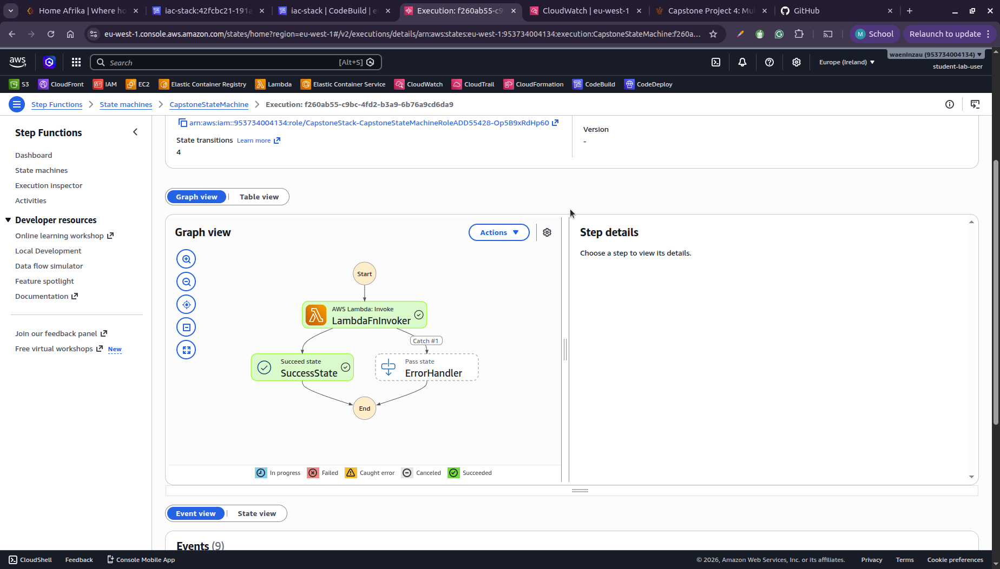
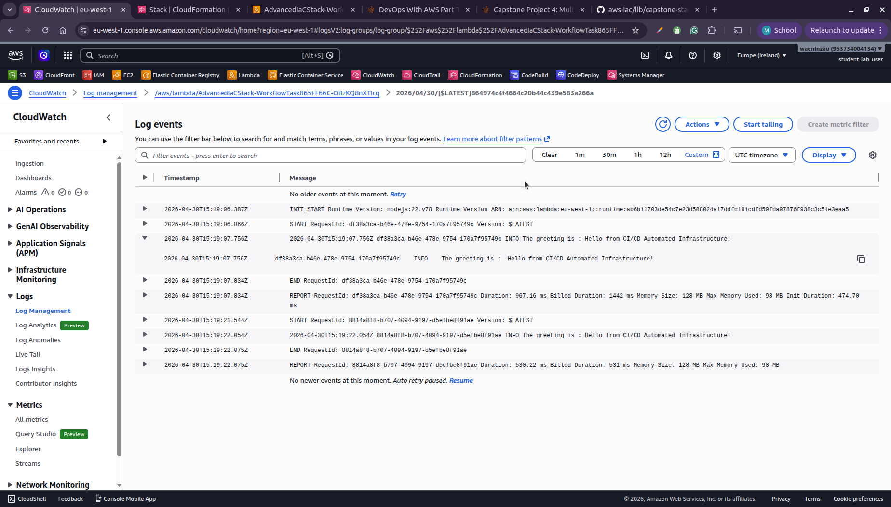

# Capstone CDK Project

## Overview
The application showcases a simple workflow where a Step Function invokes a Lambda function to retrieve a greeting message from an SSM parameter, with built-in error handling and CI/CD implemented through codepipeline.

## Features

- **Configuration Management**: Uses AWS SSM Parameter Store to store and retrieve application configuration.
- **Serverless Compute**: Leverages AWS Lambda for executing code without managing servers.
- **Workflow Orchestration**: Employs AWS Step Functions to coordinate the execution of Lambda functions.
- **Secure Access**: Implements IAM policies to grant least-privilege access to AWS resources.
- **CI/CD Pipeline**: Includes a build specification for AWS CodeBuild to automate the synthesis and deployment of the CDK stack.
- **Error Handling**: Built-in error handling in Step Functions for robust workflow execution.

## Architecture

The CapstoneStack consists of the following components:

1. **SSM Parameter Store**:
   - Stores a greeting message configuration parameter at `/app/config/greeting`.
   - Provides centralized configuration management.

2. **AWS Lambda Function**:
   - `ReadConfigFunction`: A Node.js 22.x Lambda function that retrieves the greeting parameter from SSM.
   - Uses the AWS SDK v3 for SSM operations.

3. **IAM Policies**:
   - Grants the Lambda function permission to read from the specified SSM parameter using `ssm:GetParameter` action.

4. **AWS Step Functions**:
   - Defines a state machine with a Lambda Invoke task to execute the `ReadConfigFunction`.
   - Includes an error handler state for failed executions.

5. **CI/CD Pipeline**:
   - `buildspec.yml`: Defines the build process for AWS CodeBuild, including dependency installation, TypeScript compilation, and CDK synthesis.

## Prerequisites

Before deploying this project, ensure you have the following:

- **Node.js**: Version 18 or later (recommended: 22.x for Lambda runtime compatibility).
- **AWS CDK CLI**: Install globally with `npm install -g aws-cdk`.
- **AWS Account**: An active AWS account with appropriate permissions for deploying CDK stacks.
- **AWS CLI**: Configured with your AWS credentials and default region.
- **Git**: For version control and CI/CD integration.

## Installation

1. **Clone the Repository**:
   ```bash
   git clone <repository-url>
   cd Capstone
   ```

2. **Install Dependencies**:
   ```bash
   npm install
   ```

3. **Bootstrap CDK (if not already done)**:
   ```bash
   cdk bootstrap
   ```

## Deployment

1. **Synthesize the CloudFormation Template**:
   ```bash
   npm run build
   cdk synth
   ```

2. **Deploy the Stack**:
   ```bash
   cdk deploy
   ```

   This will deploy the CapstoneStack to your default AWS account and region.

## Usage

Once deployed, you can interact with the resources as follows:

1. **Invoke the Step Function**:
   - Navigate to the AWS Step Functions console.
   - Find the state machine created by the stack (e.g., `CapstoneStack-StepFunctionStateMachine`).
   - Start a new execution to trigger the Lambda function and retrieve the greeting.

2. **Check SSM Parameter**:
   - Go to AWS Systems Manager > Parameter Store.
   - Locate the parameter `/app/config/greeting` and view its value.

3. **Monitor Logs**:
   - Use AWS CloudWatch Logs to view execution logs from the Lambda function and Step Functions.

## Screenshots

### Successful CDK Pipeline

*Figure 1: Screenshot showing a successful execution of the CDK deployment pipeline in AWS CodePipeline.*

### Step Functions Execution Graph

*Figure 2: Visual representation of the Step Functions state machine execution flow, showing the Lambda invoke task and error handling.*

### CloudWatch Logs

*Figure 3: CloudWatch logs displaying the output from the Lambda function execution, including the retrieved greeting message.*

## Testing

Run the included Jest tests:

```bash
npm run test
```

## Contributing

Contributions are welcome! Please follow these steps:

1. Fork the repository.
2. Create a feature branch.
3. Make your changes and add tests.
4. Run tests and ensure they pass.
5. Submit a pull request.

## License

This project is licensed under the MIT License. See the [LICENSE](LICENSE) file for details.

## Useful Commands

- `npm run build`: Compile TypeScript to JavaScript.
- `npm run watch`: Watch for changes and compile automatically.
- `npm run test`: Run Jest unit tests.
- `npx cdk deploy`: Deploy the stack to AWS.
- `npx cdk diff`: Compare deployed stack with current state.
- `npx cdk synth`: Emit the synthesized CloudFormation template.


